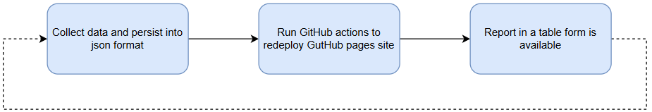
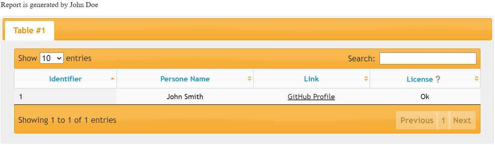

# Table Report Renderer
## Goal
This snippet allows rendering a report in a table format which is suitable for deploying into github pages (or other static content provider)

### Step1
You are collecting any data in any form which may be rendered into as a table. Multi-tab table is supported.
Store data into json file (see data.json as an example reference).

### Step 2
Run GitHib Actions to redeploy your [GitHub Pages](https://pages.github.com/) Site

Let content to be built using this framework.

### Step3
A table-like report will be available for the users
